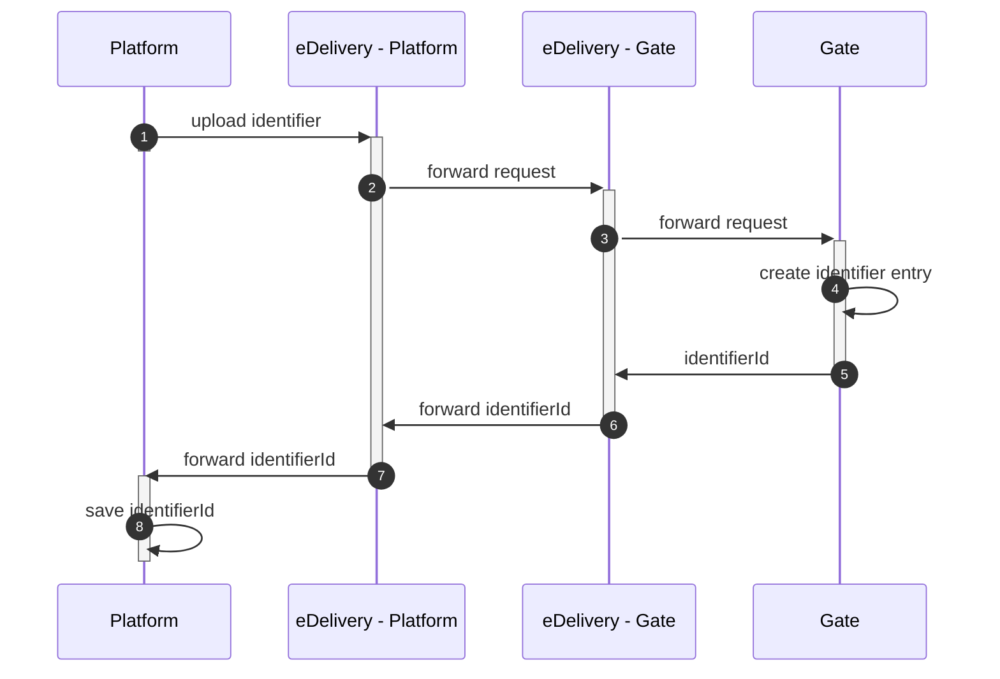
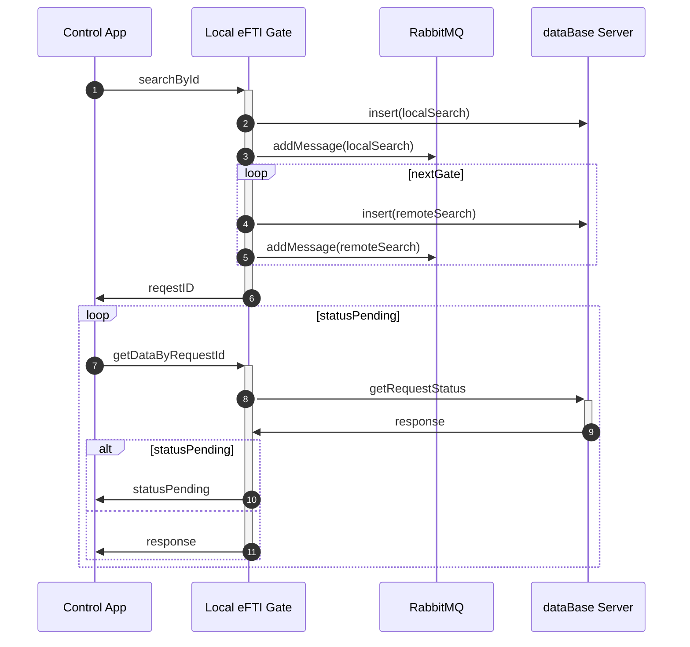
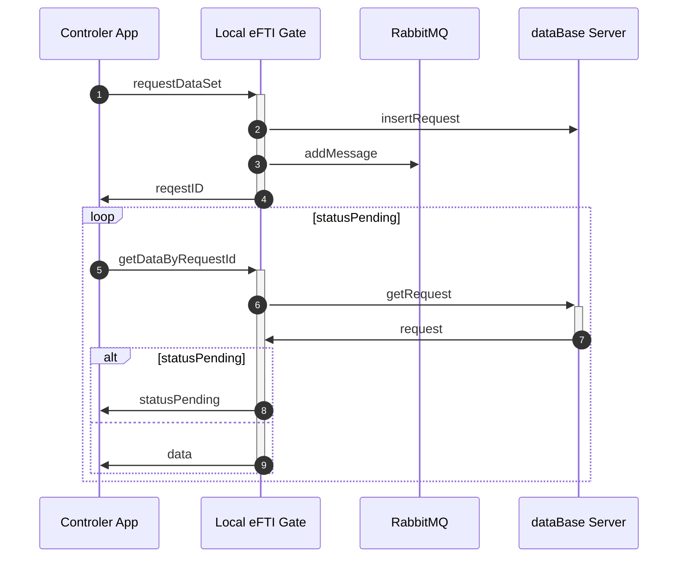
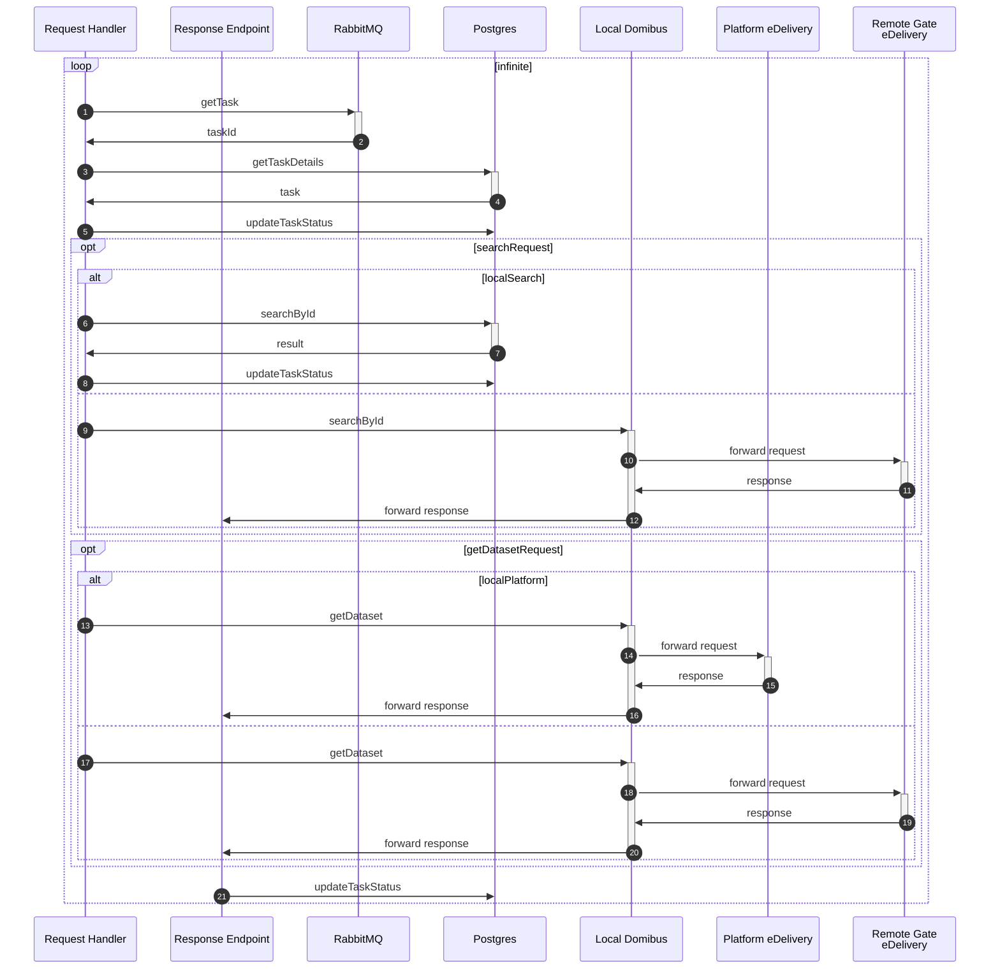

# Implementation

The development of the gate involves different components. All the components are designed as independent libraries that will be integrated into a single service. This was due to the simplicity of the gate workflows in one side, and the fact that the gate already uses many other components (databases, logger, brokers, ...), in other side.

However, these components are sufficiently independent to be easily used as separate microservices. Adaptations are required but the whole architecture doesn't need to be changed. Also, a set of dependencies are required, including databases, message brokers, authentication servers, etc.

In addition to gate components, a simulator was developed as a mockup of external gates and platforms. This simulator is required for integration and performance tests.

Here is a summary of developed components. A more detailed description can be found inside each component.

## Gate components

All the gate components are separate libraries and used to build the gate microservice.

- [Gate core](gate/README.md): This is the main component. It implements the whole process of the gate including interfaces, authentication, request handling, external systems connections, workflow definitions, ... It is the entry point of the gate for all external systems. For some processes, it can interact directly with the other parts of the systems, for some other ones, it passes through other components.

- [Registry of identifiers](registry-of-identifiers/README.md): Stores the eFTI data identifiers uploaded by the platforms and provides a query interface for this data.

- [eDelivery connector](edelivery-ap-connector/README.md): Manage the communication between the gate and the related eDelivery access point (provided by Domibus)

- [WS plugin](efti-ws-plugin/README.md): SOAP client used to communicate with domibus.

- [Common library](commons/README.md): Includes a set of useful features

- [Logger](efti-logger/README.md): Traces different types of information including technical logs, audit trail, statistics, ...

## Simulators

The reference implementation offers two simulators to run and test the gate. The idea is to mockup the external systems the gate might send to request to: national platforms and foreign gates.

The two simulators are available on the same microservice, but they require some dependencies. A more detailed description is available [here](./platform-gate-simulator/README.md)

## Dependencies

The dependencies described in the following are external tools which are required to deploy and run the gate, but not required to build it.

- **Postgresql:** the main database of the gate. Postgresql is a widely used relational database system. It is used both for long term persistent data (mainly for the registry of identifiers), but also to manage the request lifecycle and other useful purposes.
- **RabbitMQ:** a message broker to handle asynchronous requests. RabbitMQ is a widely used message broker based on MQTP protocol (among others). All the asynchronous requests all placed in an appropriate queue inside RabbitMQ before being processed.
- **Keycloak:** an authentication server. Keycloak is used as an example of a real authentication server based on OIDC/Oauth2 for authentication, identification and authorization purposes. This is not intended to be used in production; member states should adapt this reference implementation to use real authentication systems provided by the underlying authorities.
- **Domibus**: eDelivery access point. Domibus is an eDelivery (AS4) access point implementation provided by the European Commission. Using Domibus results on two additional dependencies: MariaDB as mandatory database system, and ActiveMQ as a message broker required when Domibus is deployed with more than one instance.

## Interfaces

The gate offers three interfaces: 

- eDelivery API for the foreign gates
- eDelivery and REST APIs for the local platforms
- REST API for the competent authorities

he eFTI datasets are stored in eFTI platforms. Each dataset is identified with an UIL which contains identifiers for the dataset, the platform containing the dataset and the gate that the platform is connected to. When an authority requests a dataset with an UIL, the gate requests the data from the platform and returns it to the authority. If the requested dataset is stored in a platform connected to another gate, the request is forwarded to the foreign gate, which then fetches the data from the platform. This means that the gate needs to process requests from the authorities REST API as well as the eDelivery API for the foreign gates.

The authorities can also search using identifiers, which causes the gate to perform a local search as well as sending the request to all the other connected gates. The gate then consolidates the responses and serves it to the authority.

Basically, requests are always initiated either by the authorities for search or data, or by the platforms to upload identifiers. Communication between the different gates is only to forward requests from authorities when the gate does not have the information locally.

Communication with gate is a mix of synchronous and asynchronous requests. eDelivery interfaces are always asynchronous due to the architecture of the protocol.

The authority-to-gate interface is also asynchronous due to the long time of the requests. As REST is based on HTTP, which is a synchronous protocol, the asynchronism is handled by a pool mechanism where the authority obtains a request id immediately after sending its request, and then checks periodically if a response is available. These requests are pushed to RabbitMQ and processed as soon as a worker is available.

The REST interface for platforms is synchronous due to the underlying protocol and the simplicity of the requests.

The specification of different interfaces as well as the data model of different requests is available in `schema` directory.

## Behavior

Here a set of sequence diagrams illustrating the workflows of different use cases.

### Upload identifiers

### Search for identifiers

### Request dataset

### Request handling

